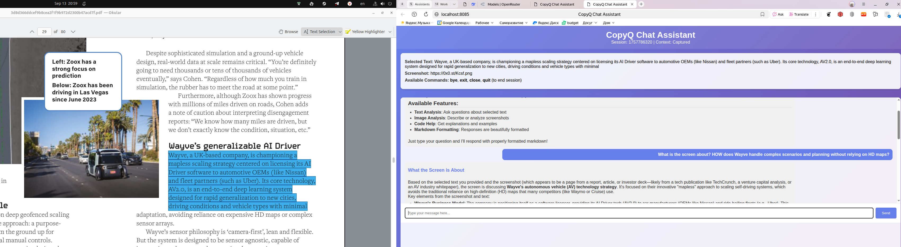
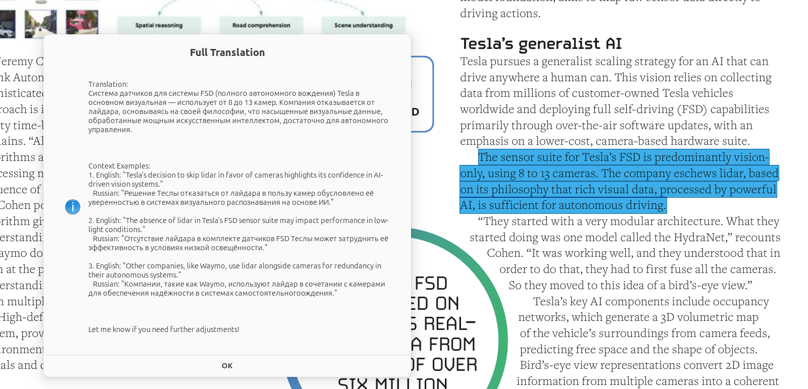

# CopyQ Research Tools

A collection of AI based CopyQ integration tools for enhanced productivity and AI-powered assistance.

## 🛠️ Available Tools

### 🤖 [CopyQ Chat Assistant](./CopyQ_Chat_Setup.md)

**Purpose**: AI-powered chat interface for analyzing screenshots and text content



**Key Features**:

- 🖼️ Smart screenshot capture with multiple fallback methods
- 📝 Intelligent text selection and clipboard integration
- 🌐 Modern web-based chat interface with markdown support
- 🤖 OpenRouter API integration for multimodal AI analysis
- 📚 Persistent chat history and session management

**Use Cases**:

- Analyze screenshots with AI assistance
- Get explanations of complex text content
- Interactive Q&A about visual and textual information
- Research assistance with image and text analysis

**Quick Start**: 

1. Set up [the ai-chat command](./CopyQ_Chat_Setup.md)

2. Press `Ctrl+Shift+I` after selecting text.

---

### 🌍 [CopyQ Translation Tool](./CopyQ_Translation_Setup.md)

**Purpose**: Instant translation between English and Russian with popup notifications



**Key Features**:

- 🔄 Automatic language detection (EN ↔ RU)
- 📱 Disappearing popup notifications (8-second display)
- 📋 Seamless clipboard integration
- 🚀 One-click translation without copying text first
- 💡 Context examples for better understanding

**Use Cases**:

- Reading foreign language articles while browsing
- Understanding technical documentation in other languages
- Real-time translation in conversations
- Language learning with context examples
- Quick translation for content creation

**Quick Start**: 

1. Set up [the translation command](./CopyQ_Translation_Setup.md)

2. Press `Ctrl+Shift+T` after selecting text.

---

## 🚀 Getting Started

### Prerequisites

- CopyQ installed and running
- OpenRouter API key
- Internet connection for AI services

### Common Setup Steps

1. **Install Dependencies**: Run `./setup_venv.sh` for Python tools
2. **Set API Key**: `export OPENROUTER_API_KEY="your-key-here"`
3. **Configure CopyQ**: Add commands with specified shortcuts
4. **Test Tools**: Verify functionality with sample content

### System Requirements

- Linux desktop environment
- Python 3.8+ (for Chat Assistant)
- `jq`, `notify-send`, `xclip`, `xsel` (for Translation Tool)
- Screenshot tools: `gnome-screenshot`, `scrot`, or `imagemagick`

## 📁 Project Structure

```
├── README.md                    # This overview
├── PYTHON_CHAT_SETUP.md        # Chat Assistant documentation
├── CopyQ_Translation_Setup.md  # Translation Tool documentation
├── copyq_chat.py               # Chat Assistant main application
├── copyq_chat_command.sh       # Chat Assistant CopyQ wrapper
├── copyq_translate.sh          # Translation Tool script
├── setup_venv.sh               # Python environment setup
├── requirements.txt            # Python dependencies
└── venv/                       # Virtual environment (created by setup)
```

## 🔧 Configuration

### Environment Variables

- `OPENROUTER_API_KEY`: Required for both tools
- `OPENROUTER_MODEL`: AI model selection (default: sonoma-sky-alpha)
- `COPYQ_CHAT_BROWSER`: Preferred browser for chat interface
- `COPYQ_CHAT_PORT`: Web server port (default: 8085)

### CopyQ Shortcuts

- **Chat Assistant**: `Ctrl+Shift+I`
- **Translation Tool**: `Ctrl+Shift+T`

## 🆘 Support & Troubleshooting

### Common Issues

1. **Virtual environment not found**: Run `./setup_venv.sh`
2. **Missing dependencies**: Check individual tool documentation
3. **API key not set**: Export `OPENROUTER_API_KEY`
4. **CopyQ not responding**: Ensure CopyQ server is running (`copyq &`)

### Getting Help

- Check individual tool documentation for detailed troubleshooting
- Verify all prerequisites are installed
- Test components individually using provided test commands
- Run tools with verbose output for debugging

## 🔒 Security & Privacy

- API keys stored in environment variables
- Screenshots stored locally in `~/.copyq_screenshots/`
- Chat history stored locally in `~/.copyq_chat_history/`
- Images uploaded to temporary hosting services
- No personal data sent to external services except OpenRouter API

## 📄 License

This project is open source. Feel free to modify and distribute according to your needs.

---

**Choose your tool and follow the specific documentation for detailed setup and usage instructions!**
